# AVR Scrolling LED Display
Advanced Scrolling LED Display using AVR microcontrollers

The microcontroler source code simulates a mutithreaded environment to have multiple separate contents displayed simultaneously on different regions on the LED display.
Having several display features:
  1. Designed for ATMega32, Mega64 and Mega128
  2. Multiple regions
  3. Date and time
  4. Temperature
  5. Animations
  6. Customizable fonts
  7. Scrolling and fixed text display
  8. Display scrolling image
  9. Different and attractive page transitions
  10. Timeline style for contents
  11. Max display size: 128 Columns x 32 Rows (128x32)
  12. Portable memory
  13. Customize scroll speed
  14. Fully controllable from an app on the PC (writtent in Delphi, Persian language interface)
  15. Alarams

# Some images from Scrolling LED Displays in action
More videos available in the directory "sample-videos-of-led-display-in-action".

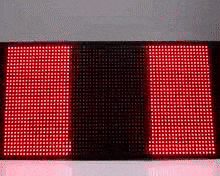 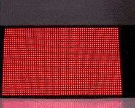

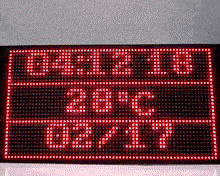 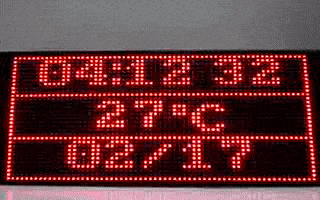

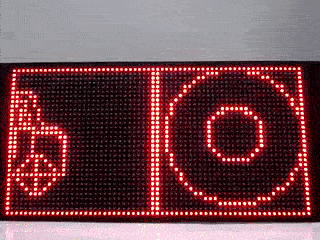 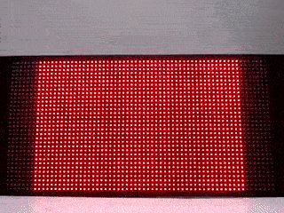

# Some images from app interface
More images available in the directory "app-images".

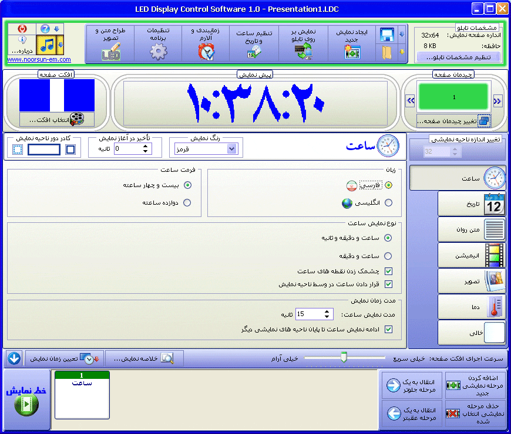 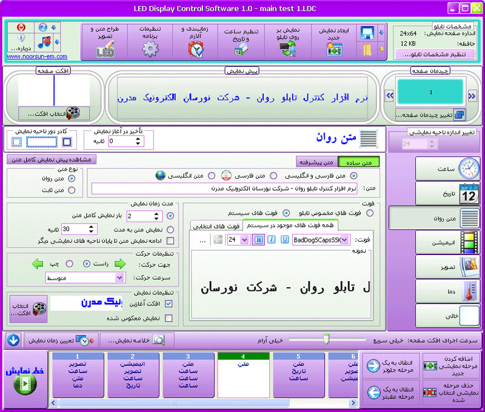

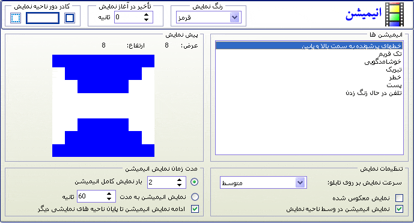 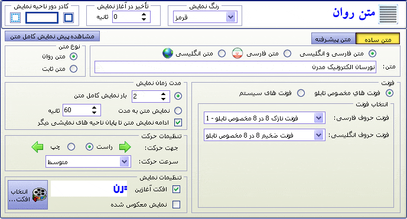

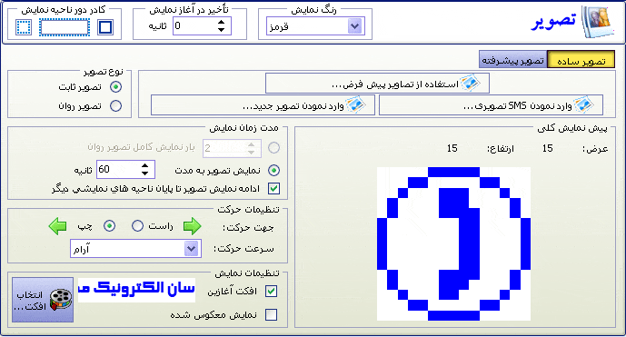 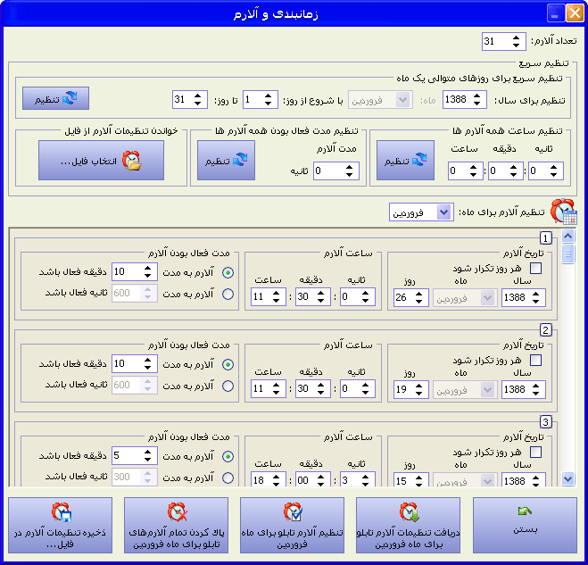

